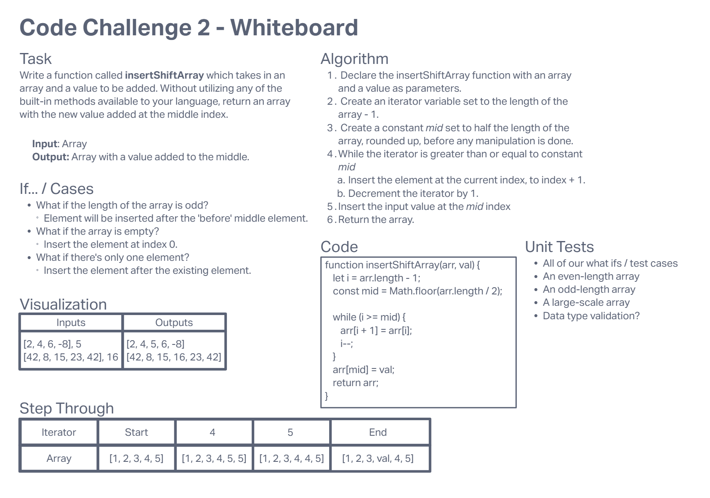

# Array Insert Shift
<!-- Description of the challenge -->

## Tasks

Write a function called `insertShiftArray` which takes in an array and a value to be added. Without utilizing any of the built-in methods available to your language, return an array with the new value added at the middle index.

## Whiteboard Process
<!-- Embedded whiteboard image -->

## Approach & Efficiency
<!-- What approach did you take? Discuss Why. What is the Big O space/time for this approach? -->
My approach uses the assumption that the array will have a static length throughout the entire operation. It uses that length both as a part of the calculation of the amount of loop iterations as well as in referencing where the middle of the array is located. After shifting all of the back-half elements up.

Even though we only have to loop through the array half as many times as its length, the time complexity is still O(n), and the space complexity is O(1).
