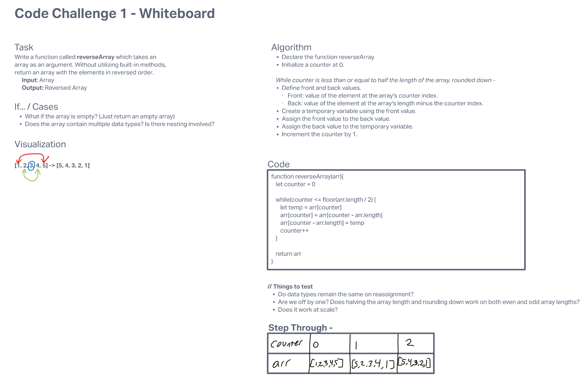

# Reverse an Array
<!-- Description of the challenge -->

## Tasks

- Write a function called reverseArray which takes an array as an argument.
- Without utilizing any of the built-in methods available to your language, return an array with elements in reversed order.

## Whiteboard Process
<!-- Embedded whiteboard image -->

## Approach & Efficiency
<!-- What approach did you take? Discuss Why. What is the Big O space/time for this approach? -->
My approach uses the assumption that the array will have a static length throughout the entire operation. It uses that length both as a part of the calculation of the amount of loop iterations as well as in referencing where the back of the array is located.  

Even though we only have to loop through the array half as many times as its length, the time complexity is still O(n).
