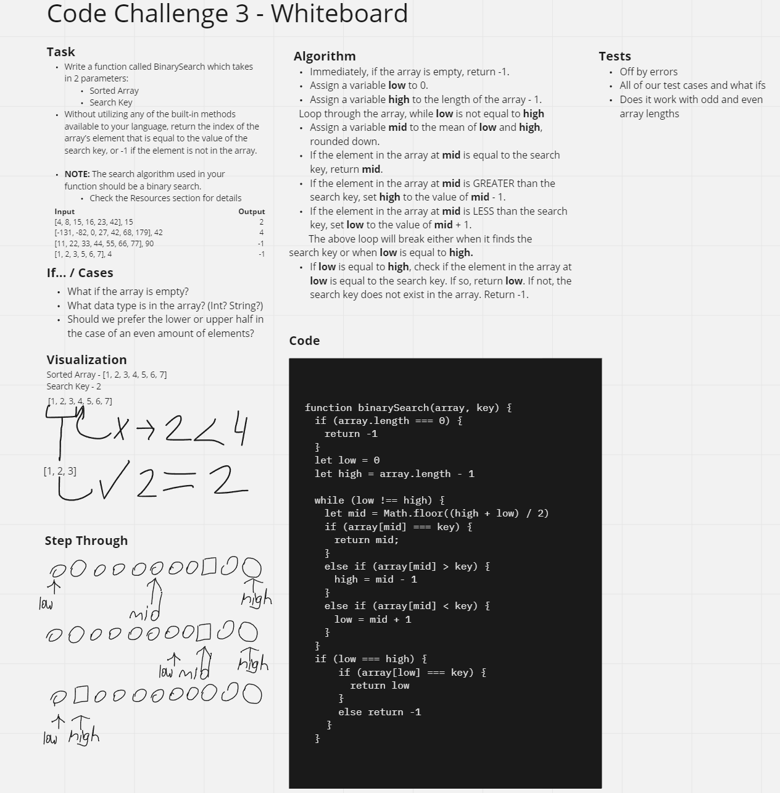

# Binary Search
<!-- Description of the challenge -->

## Tasks

- Write a function called binarySearch which takes in 2 parameters:
  - Sorted Array
  - Search Key
  
- Without utilizing any of the built-in methods available to your language, return the index of the array’s element that is equal to the value of the search key, or -1 if the element is not in the array.

- **NOTE**: The search algorithm used in your function should be a binary search.

## Whiteboard Process
<!-- Embedded whiteboard image -->

## Approach & Efficiency
<!-- What approach did you take? Discuss Why. What is the Big O space/time for this approach? -->
The time efficiency of a binary search is O(log n). The displayed solution is an iterative approach, rather than a recursive approach.
