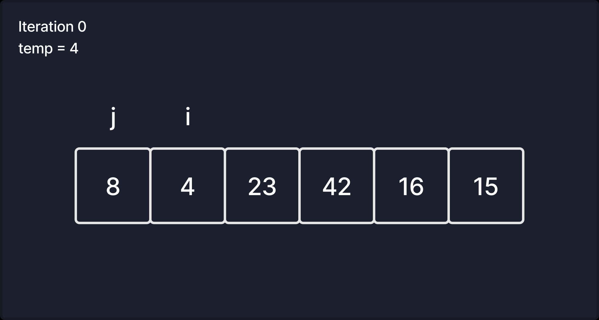

# Insertion Sort

Welcome! Today, we're going to go over the insertion sort algorithm. Let's jump right into some pseudocode, and then we'll walk through it line-by-line.

#### Pseudocode

```
InsertionSort(int[] arr)

  FOR i = 1 to arr.length

    int j <-- i - 1
    int temp <-- arr[i]

    WHILE j >= 0 AND temp < arr[j]
      arr[j + 1] <-- arr[j]
      j <-- j - 1

    arr[j + 1] <-- temp
```

*Note: I'll going to be writing some code samples in JavaScript, so some of the concepts in this pseudocode, like type declarations, won't completely translate.*

Easy enough, right? Let's walk through it. As we do, I'll translate the line's we've covered to JavaScript.

#### Pseudocode

```
InsertionSort(int[] arr)
```

This line is declaring a function called `InsertionSort`. It takes in a single parameter, which is called `arr` and has been defined as an *array of integers*. Let's look at this in JavaScript.

#### Javascript

```javascript
function insertionSort(arr) {
// Code goes here
}
```

So, in regular JavaScript we can't enforce types during compilation. We could check for types in our function, *or* we could just use TypeScript. Anyway, let's move on!

#### Pseudocode

```
FOR i = 1 to arr.length
```

It's a for loop! We're going to create a counter called `i`, set it to 1, and then loop until its value is equal to the length (number of elements) in `arr`.

#### Javascript

```javascript
function insertionSort(arr) {
  for (let i = 1; i < arr.length; i++) {
    // Code goes here
  }
}
```

Got that? Okay, let's get into some unknown territory.

#### Pseudocode

```
int j <-- i - 1
int temp <-- arr[i]
```

More variables! We're creating a variable `j` and setting it to the value of `i - 1`. Because `i` is an integer, we can safely declare `j` as an integer in this case... If we were actually declaring types. `temp` is set to the actual value of the element in the array at position `i`. Remember, it's an array of integers, so this should also be an integer!

#### Javascript

```javascript
function insertionSort(arr) {
  for (let i = 1; i < arr.length; i++) {
    let j = i - 1;
    let temp = arr[i];

    // More code
  }
}
```

Notice that we set `i` to 1. Why do you think that is? Many times, our default instinct may be to initialize `i` in a for loop to 0. After all, arrays are zero-indexed. Well, we can assume that this has *something* to do with what `j` will be doing. Let's see what happens.

#### Pseudocode

```
WHILE j >= 0 AND temp < arr[j]

```

Another loop! This time a *while* loop. So, as long as `j` is greater than *or equal to* 0, AND as long as `temp` is less than `arr[j]`, we'll be doing *something*. So we're using `j` to check inside `arr` as well. Interesting!

#### Javascript

```javascript
function insertionSort(arr) {
  for (let i = 1; i < arr.length; i++) {
    let j = i - 1;
    let temp = arr[i];

    while (j >= 0 && temp < arr[j]) {
      // More code
    }
  }
}
```

Notice that we now have a *nested loop*. Let's take a quick break from the code to introduce a visual.



So, thinking about our *while* conditional, this should be `true`, right? `j` is 0, and we set `temp` to the value of whatever the element's value at `i` is. That means we'll end up doing something! Let's look at what that is.

#### Pseudocode

```
<-- Curly braces added for clarity -->

WHILE j >= 0 AND temp < arr[j]
{
  arr[j + 1] <-- arr[j]
  j <-- j - 1
}
arr[j + 1] <-- temp

```

Let's convert this to JavaScript!

#### JavaScript

```javascript
function insertionSort(arr) {
  for (let i = 1; i < arr.length; i++) {
    let j = i - 1;
    let temp = arr[i];

    while (j >= 0 && temp < arr[j]) {
      arr[j + 1] = arr[j];
      j = j - 1;
    }
    arr[j + 1] = temp;
  }
}
```

See the pattern here? Our first loop is a `for` loop, and we're incrementing `i` up by 1 every iteration. Every time we do that, we start a new while loop with `j`, and it moves *backwards* through the array. It's comparing values as it moves backwards, and if it sees that `temp` is smaller than `j`'s own element's value, it swaps them! It does this until it reaches the very beginning of the array or until `temp` is larger than its element's value. Once that happens, we set the element *after* whatever position we stopped at to `temp`.

Okay, that's a lot of words. We could do with a visual!


## Conclusions

Hopefully the visuals help with your understanding of this sorting algorithm. As you can probably tell, it's not typically the best choice on very large sets of data.  

 Think of it like sorting a deck of cards only by looking at the top card. In practice, we're creating a sorted array one element at a time. In this case, we're doing it all *in place*. When we come to an element that's smaller than the largest element of the "sorted" portion of the array, we move it backwards until it's in the correct spot. We *insert* it into its proper position!

 And that's the insertion sort! Thanks for reading!