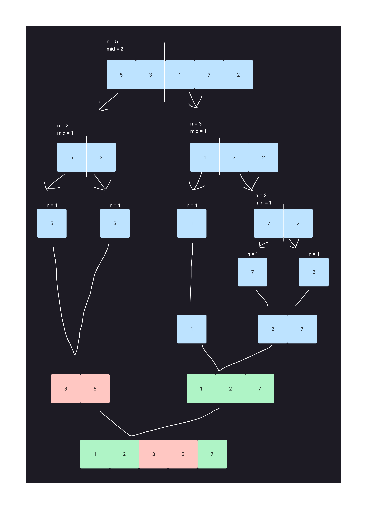
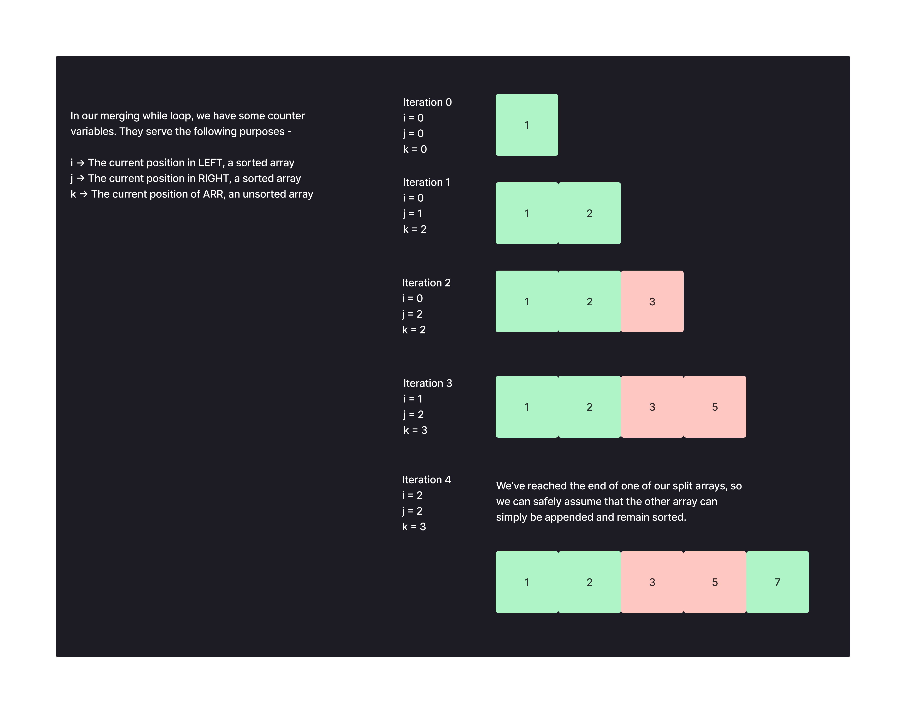

# Merge Sort

## What is a merge sort?

In a merge sort, we split the container in half until we’ve broken it down into its smallest possible unit. In this case, our container is an array, and the smallest possible unit is an array with a single element.

Afterwards, we begin the sequence of merging. We use conditionals to check the size of the elements in each side, and build the array back up in a sorted manner, piece by piece.

It looks a bit like this:



Let's look a bit closer at how we break these down using pseudocode.

```
FUNCTION mergeSort(arr)
  DECLARE n <-- arr.length

  if n > 1
    DECLARE mid <-- n/2
    DECLARE left <-- arr[0...mid]
    DECLARE right <-- arr[mid...n]
    // sort the left side
    mergeSort(left)
    // sort the right side
    mergeSort(right)
    // merge the sorted left and right sides together
    merge(left, right, arr)
```

We're using recursion to continuously split the array in half. Technically, in this case, the *entire* left side of the array is split recursively, worked over, and sorted. *Then* we do the same for the right side. Only after both of these things happen do we merge both halves back into each other. Let's take a closer look at that final merge.

First, some pseudocode.

```
FUNCTION merge(left, right, arr)
  DECLARE i <-- 0
  DECLARE j <-- 0
  DECLARE k <-- 0

  while i < left.length && j < right.length
    if left[i] <= right[j]
      arr[k] <-- left[i]
      i <-- i + 1
    else
      arr[k] <-- right[j]
      j <-- j + 1

    k <-- k + 1

  *** Set the remaining values of arr to what is remaining in left, if anything ***
  while i < left.length
    arr[k] <-- left[i]
    i <-- i + 1
    k <-- k + 1

  *** Set the remaining values of arr to what is remaining in right, if anything ***
  while j < right.length
    arr[k] <-- right[j]
    j <-- j + 1
    k <-- k + 1
```

There's a lot going on here. Hopefully a visual will help to break down what's happening.

