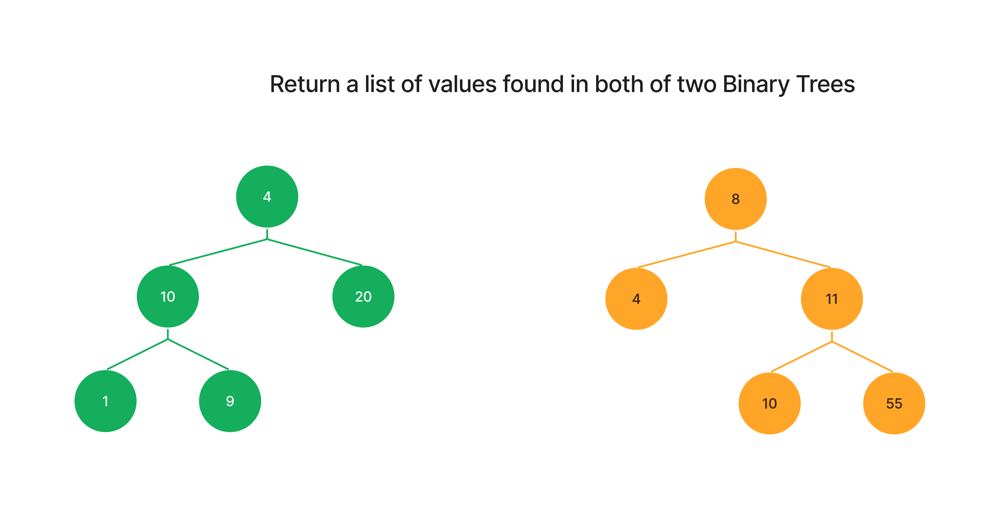
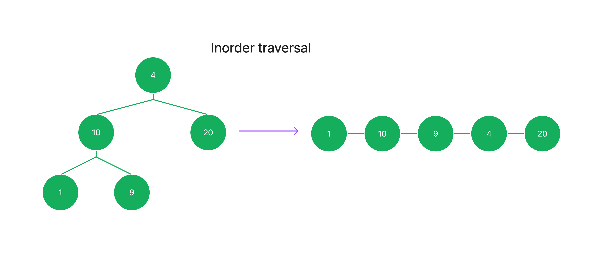
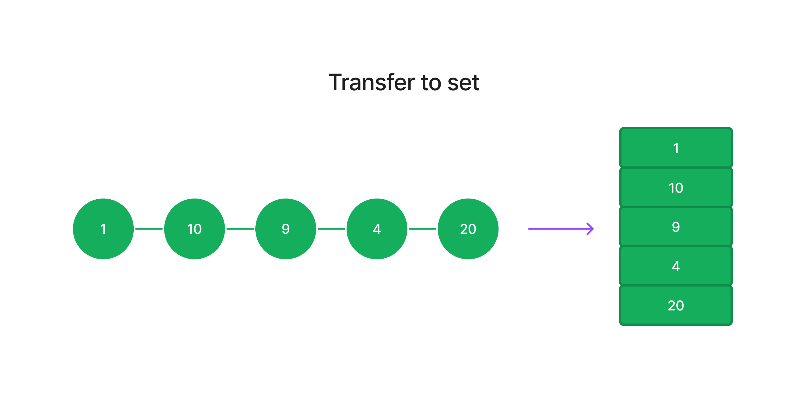
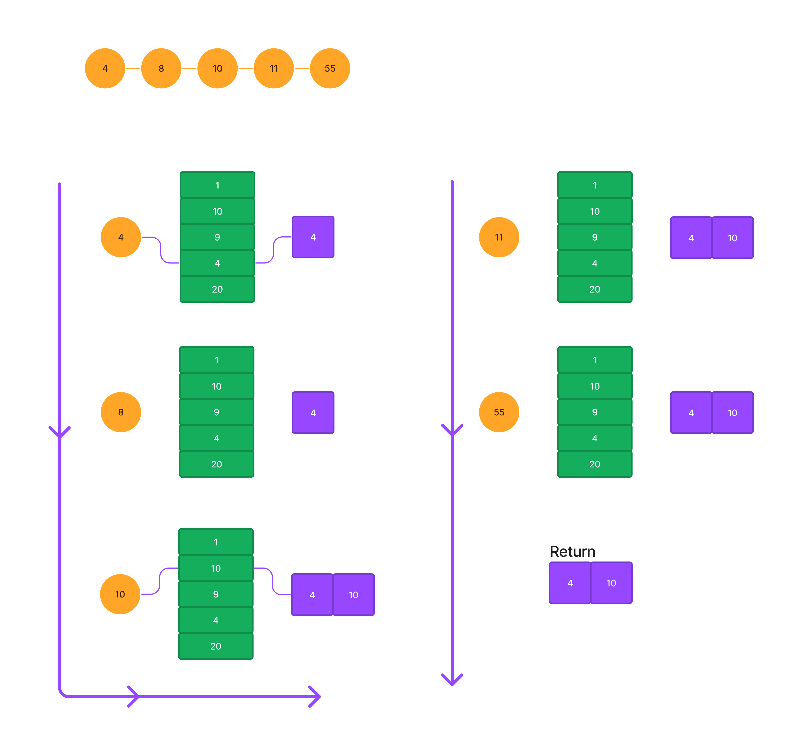

# Tree Intersection



## Steps to solve

### Step 1

Traverse the first tree using a method that allows for passing each node’s value to a callback function.

_Note: If the tree implementation has a length property, I believe traversing the smaller tree first has a slight chance at being more efficient._



### Step 2

Using a callback function, add each value in the first tree to a set. This can be done using a custom hash table implementation. Take the tree's node value and use it as a key in the hash table, setting its value to `true`.

Represented in object format, the resulting hash table should look like the following example.

```json
{
  "1": true,
  "10": true,
  "9": true,
  "4": true,
  "20": true
}
```



### Step 3

Create an empty array to store the found duplicates.

### Step 4

Traverse the second tree using the same callback pattern as before. This time, check the value of each node against the set/hash table. If the value exists in the hash table, push it to the array.



## Result

The function will return an array with the duplicate values.
